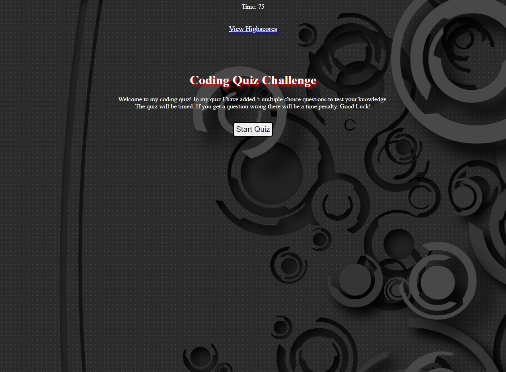

# web-api-code-quiz

## **Link to deployed application**
https://jjgavery.github.io/web-api-code-quiz/

## **Description**  
In this challenge I made a coding based quiz. There are 5 questions with 4 multiple choices. The quiz is timed. If an incorrect answer was chosen there is a time penalty. 

## **Technologies**
- HTML
- CSS
- JAVASCRIPT

## **Preview**
 
